CUDA Path Tracer
================

* Yiding Tian
  *  [LinkedIn](https://linkedin.com/in/ytian1109), [Github](https://github.com/tonytgrt)
* Tested on: Windows 11 24H2, i9-13900H @ 4.1GHz, 32GB RAM, MSI Shadow RTX 5080 16GB Driver 581.15, Personal Laptop with External Desktop GPU via NVMe connector (PCIe 4.0 x4 Protocol)
* Base code provided by University of Pennsylvania, CIS 5650: GPU Programming and Architecture

## Project Overview
A CUDA-based path tracer capable of rendering globally-illuminated images for various custom scenes. 

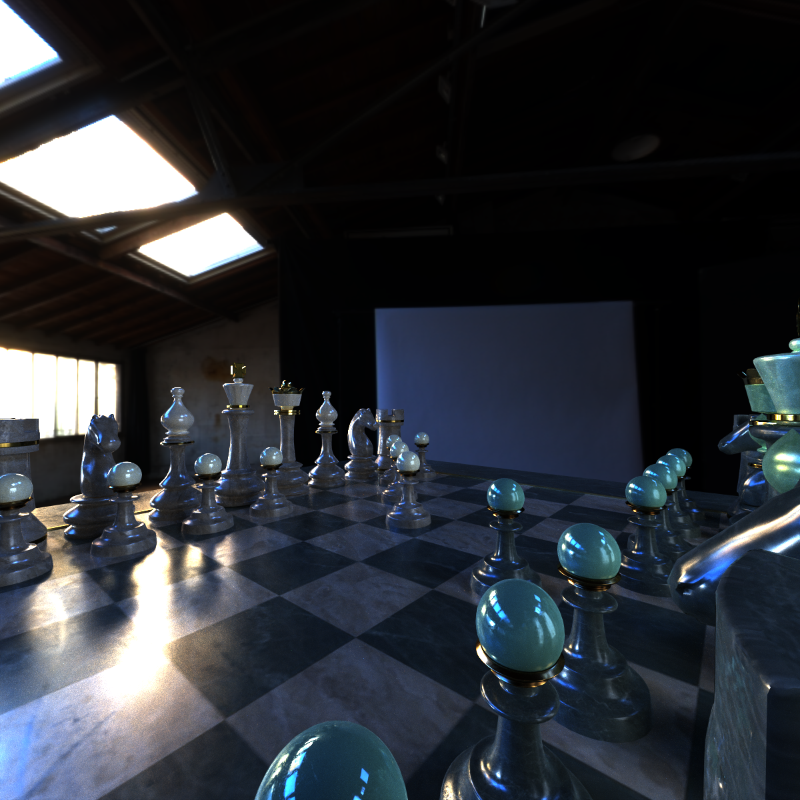

### Feature Highlights

* Diffuse, Specular, Refractive, and PBR (Physically Based Rendering) shaders
* MIS (Multiple Importance Sampling) on diffuse and PBR materials
* Subsurface Scattering for PBR materials
* Custom environment maps and GLTF models loading with materials/textures/metallic etc.
* BVH (Bounding Volume Hierachy) data structure that enables rendering complex GLTF models with millions of polygons at a reasonable speed
* Material sorting, stream compaction, and Russian Roulette ray termination to boost performance
* Stochastic sampled anti-aliasing to produce sharper renders
* Nvidia OptiX Denoiser integration, configurable in real time to enable quick preview and enhance the end result
* Enhanced ImGUI user interface with detailed real-time statistics monitoring and scenes/camera/denoiser controls

### Galleries

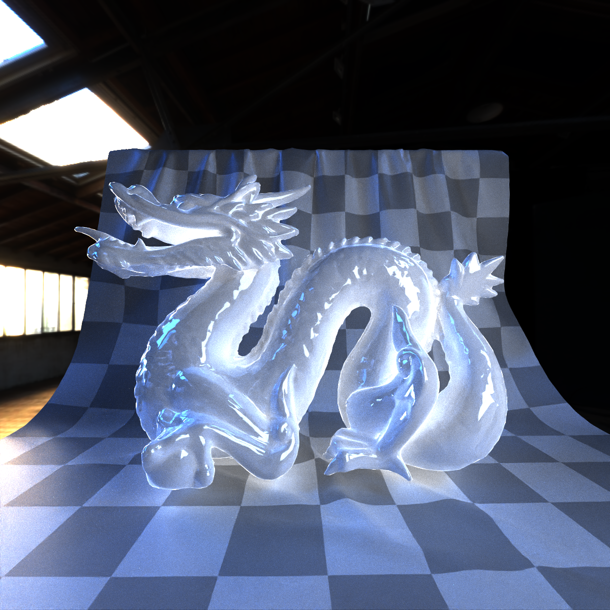

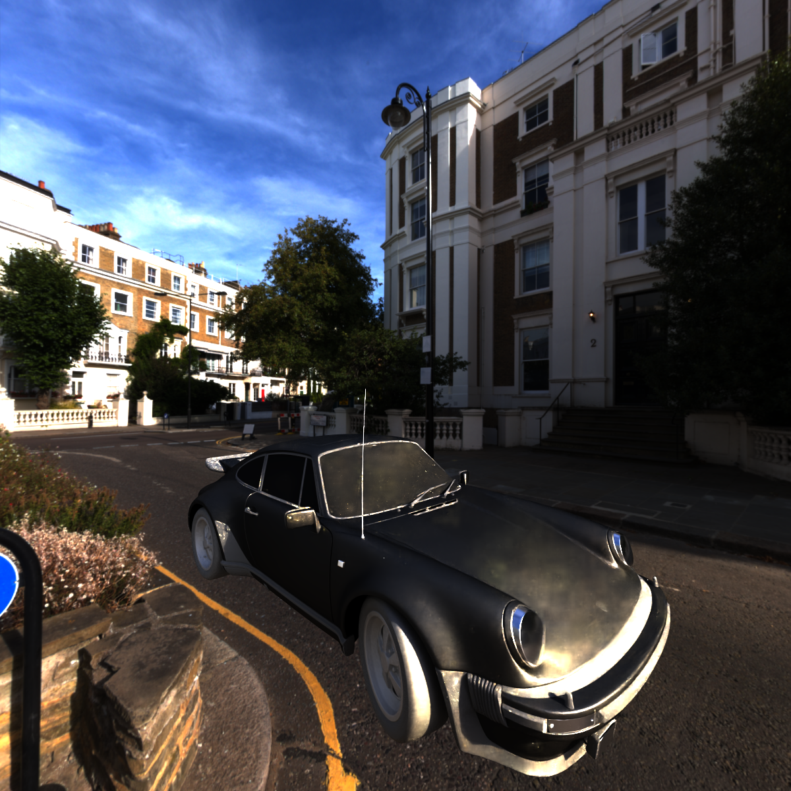

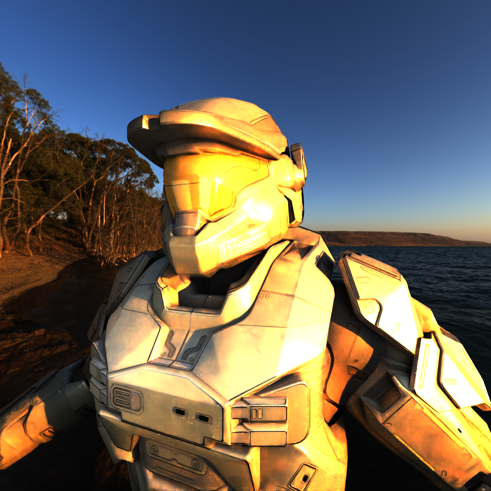

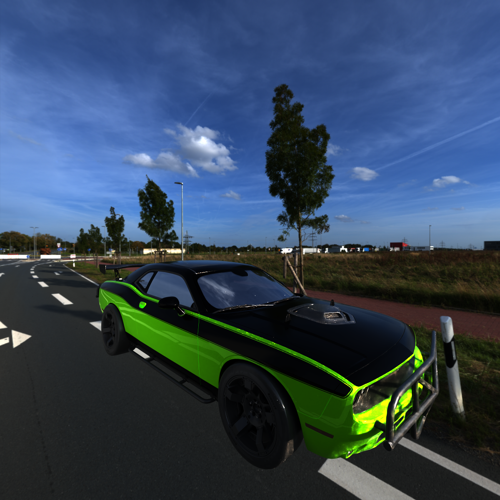

## Build and Run Instructions (Windows)

### Build Instructions

1. Make sure to have [CUDA](https://developer.nvidia.com/cuda-downloads), [CMake 4.x](https://cmake.org/download/), and [Visual Studio 2022](https://visualstudio.microsoft.com/) installed on your PC with a modern Nvidia GPU (20-Series or later)
2. Clone the repo. Open a terminal in the repo's root directory. Run the following commands:

```
mkdir build
cd build
cmake ..
```

3. This should create a `cis565_path_tracer.sln` file inside the `build` folder. Double click to open it in Visual Studio 2022.
4. In Visual Studio 2022's top menu bar, change the build mode from `Debug` to `Release`. This impacts the rendering performance a lot! Leaving in `Debug` mode would result in extremely slow rendering speed.
5. On the `Solution Explorer` menu to the left of the Visual Studio, right click on the `cis565_path_tracer` project and select `properties`. Then in the pop-up window, find `Configuration Properties` - `Debugging` - `Command Arguments`. Enter the starting `.json` scene configuration's relative file path here. An example would be `../scenes/chess.json`. You can change the `.json` scene file input here to configure startup scene to be rendered.
6. Click the Build icon on top of the Visual Studio. You will see the rendering program opened soon.

### Run Guide

* Drag Left mouse to rotate. Right mouse to pan. Scroll to zoom. Adjust the `Zoom Speed` bar in ImGUI window to change zoom speed.
* Enter a new file path in the ImGUI window to load a new scene without restarting the program.
* Click `Save Image` button to save current render image. The image will be saved under `build` directory in `.png` format. Upon finishing all iterations the program will automatically exit and save the image as well.
* Under `OptiX Denoiser` panel, the denoiser can be configured in real time. Change the `Blend Factor` bar to see how the denoised render compare to the original.
* Refer to current `.json` scene configuration files under `scenes` to see how to create your own scene file. The environmen maps should be in `.hdr` format under `envmaps` folder. The GLTF models should be in `.glb` format under `GLTF` folder.

## Core Features Completed

### Diffuse Shader

The diffuse shader implements physically-based Lambertian reflection using **cosine-weighted hemisphere sampling**. The implementation in `shadeDiffuse()` generates random ray directions that follow the probability distribution of Lambert's cosine law, ensuring unbiased global illumination.

Key implementation details:
- Uses the `calculateRandomDirectionInHemisphere()` function which generates rays with cosine-weighted distribution
- The sampled direction is computed in local space and then transformed to world space using an orthonormal basis constructed from the surface normal
- For pure diffuse surfaces with cosine-weighted sampling, the BRDF and PDF terms cancel out mathematically, simplifying the calculation to just multiplying by the material color


### Material Sorting

Material sorting optimizes GPU performance by grouping rays that interact with the same material type, improving warp coherence and reducing divergence during shading calculations. The implementation uses thrust's efficient parallel sorting algorithms.

Implementation workflow:
1. After intersection testing, extract material IDs for each ray using the `extractMaterialIds` kernel
2. Create an index array to track original ray positions
3. Use `thrust::sort_by_key()` to sort rays by material ID in parallel
4. Reorder both `PathSegment` and `ShadeableIntersection` arrays based on sorted indices using the `reorderByMaterial` kernel
5. Swap pointers to use sorted data for shading stage

This feature is toggled via the `MATERIAL_SORTING` preprocessor flag in `pathtrace.h` for easy performance comparison.

<table>
<tr>
<td align="center">
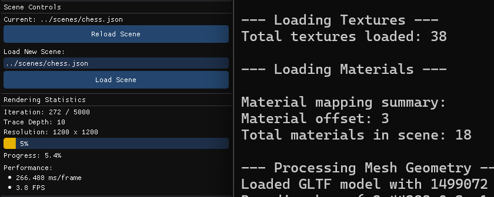
<br>
<em>Scene with 18 materials With Material Sorting (266ms frametime)</em>
</td>
<td align="center">
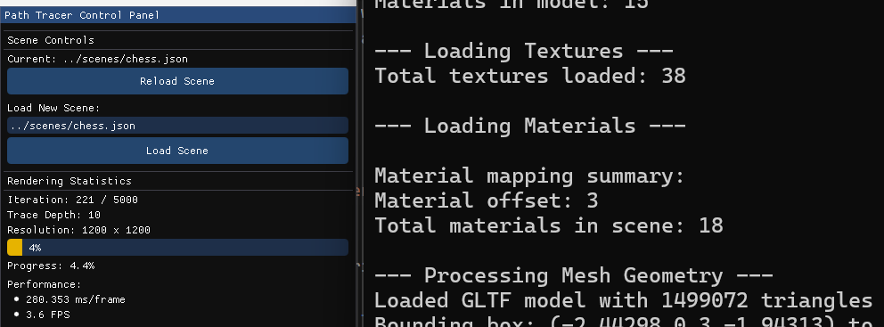
<br>
<em>Scene with 18 materials Without Material Sorting (280ms frametime)</em>
</td>
</tr>
</table>


### Stream compacted ray termination

Stream compaction efficiently removes terminated rays from the active ray pool, significantly reducing unnecessary computation in later bounces. The implementation uses thrust's parallel algorithms.

The termination and compaction pipeline:
1. After shading, rays that hit nothing or have exhausted their bounces are marked with `remainingBounces = 0`
2. The `gatherTerminatedPaths` kernel accumulates color contributions from terminated paths
3. `thrust::remove_if()` with the `is_terminated()` functor compacts the ray array in parallel
4. The compacted array size determines the number of active rays for the next bounce
5. Russian Roulette termination (when enabled) provides additional probabilistic termination based on throughput

The efficiency gain is most pronounced after several bounces when many rays have terminated naturally or hit light sources.

<table>
<tr>
<td align="center">
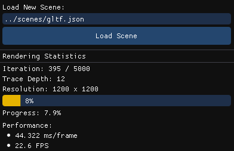
<br>
<em>Trace Depth 12 With Stream Compaction (44ms frametime)</em>
</td>
<td align="center">
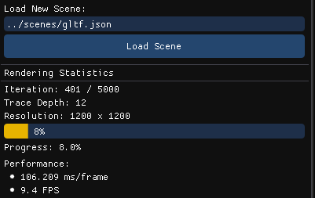
<br>
<em>Trace Depth 12 Without Stream Compaction (106ms frametime)</em>
</td>
</tr>
</table>

### Stochastic sampled anti-aliasing

Implementation in `generateRayFromCamera()`:
1. Each pixel is subdivided into a 2×2 grid (configurable via `GRID_SIZE`)
2. Over multiple iterations, the path tracer cycles through different cells in the grid
3. Within each cell, a random offset is applied using thrust's random number generator
4. The jittered position is used to generate the camera ray, with coordinates calculated as:
   - `pixelX = x + jitterX - 0.5` (centered around pixel center)
   - `pixelY = y + jitterY - 0.5`
5. Ray direction is computed through the jittered pixel position for sub-pixel sampling

<table>
<tr>
<td align="center">
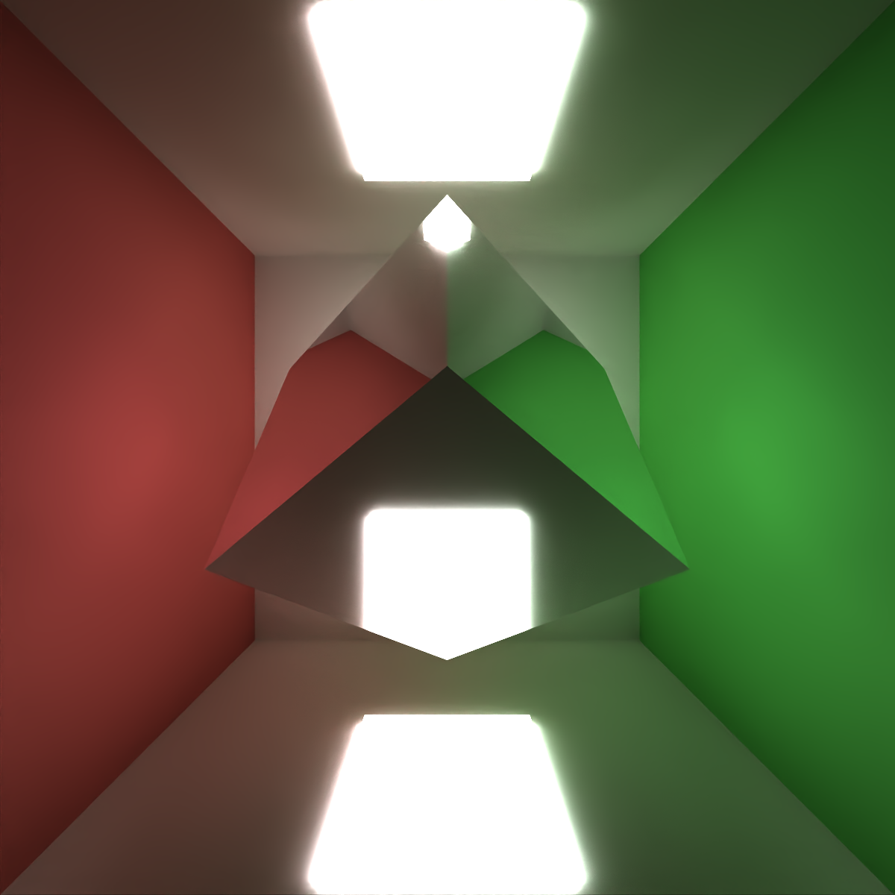
<br>
<em>Without SSAA (GRID_SIZE = 1)</em>
</td>
<td align="center">
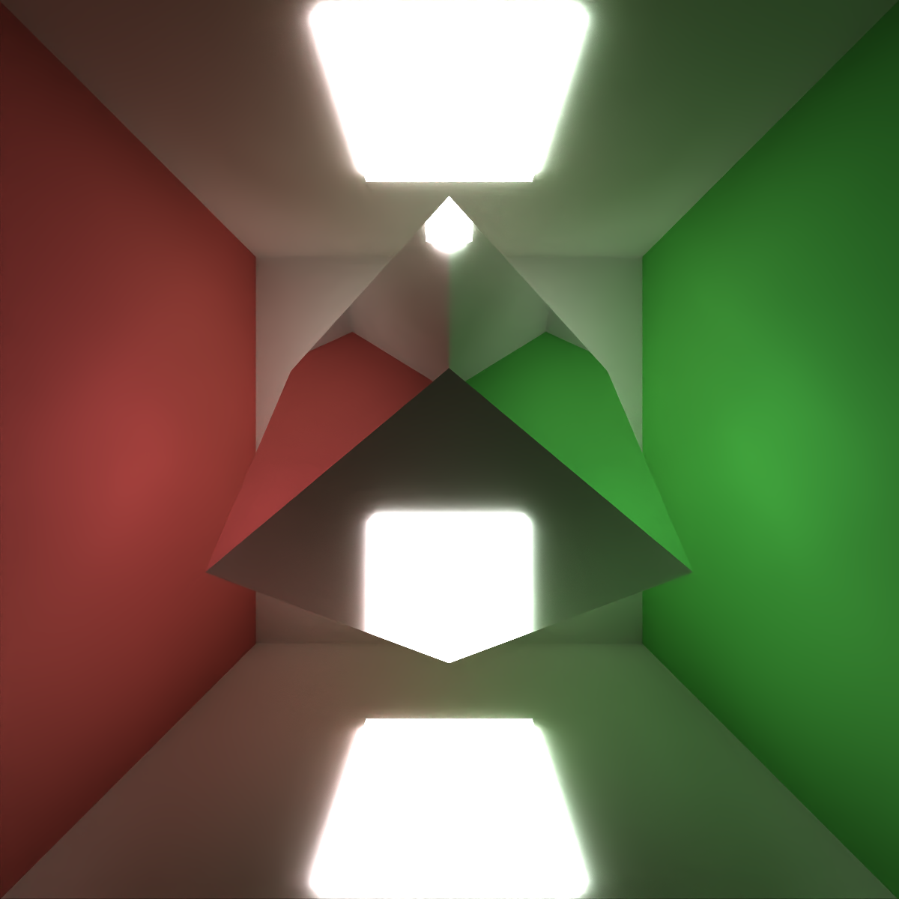
<br>
<em>With SSAA (GRID_SIZE = 1024)</em>
</td>
</tr>
<tr>
<td align="center">
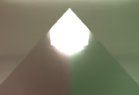
<br>
<em>Without SSAA Zoomed</em>
</td>
<td align="center">
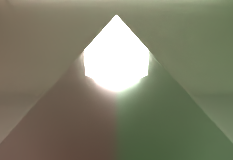
<br>
<em>With SSAA Zoomed</em>
</td>
</tr>
</table>


## Extended Features Implemented

### Specular Shader

Implemented perfect specular (mirror) reflection using the reflection equation. The `shadeSpecular()` function calculates the reflected ray direction based on the incident ray and surface normal, creating realistic mirror surfaces that can reflect the entire scene including other objects and environment maps.

### Refractive Shader

Full implementation of refractive materials for glass and transparent objects with physically accurate light bending. Features include:
- Snell's law refraction with configurable index of refraction (IOR)
- Fresnel effects using Schlick's approximation for realistic reflectance at different angles
- Total internal reflection handling for rays traveling from dense to less dense media
- Proper handling of rays entering and exiting refractive objects

The `shadeRefractive()` function determines whether to reflect or refract based on Fresnel equations, creating realistic glass and water effects.

#### Cornell Box with Refractive, Specular, and Diffuse objects
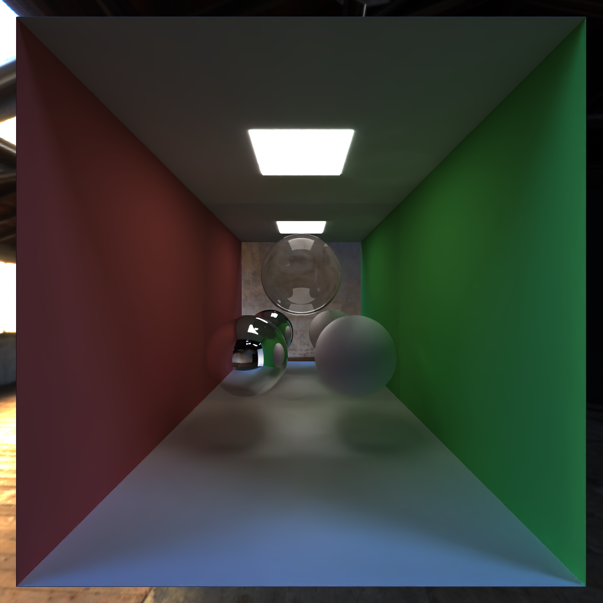

### PBR Shader

Comprehensive Physically Based Rendering implementation using the metallic-roughness workflow. The `shadePBR()` function implements:
- Cook-Torrance BRDF with GGX/Trowbridge-Reitz distribution
- Smith's geometry function for masking and shadowing
- Fresnel term using Schlick's approximation
- Support for metallic (0-1) and roughness (0-1) parameters
- Transparency support with proper alpha blending
- Energy conservation between diffuse and specular components

Materials can smoothly transition from dielectric to metallic and from rough to smooth surfaces.

#### PBR Example with different materials

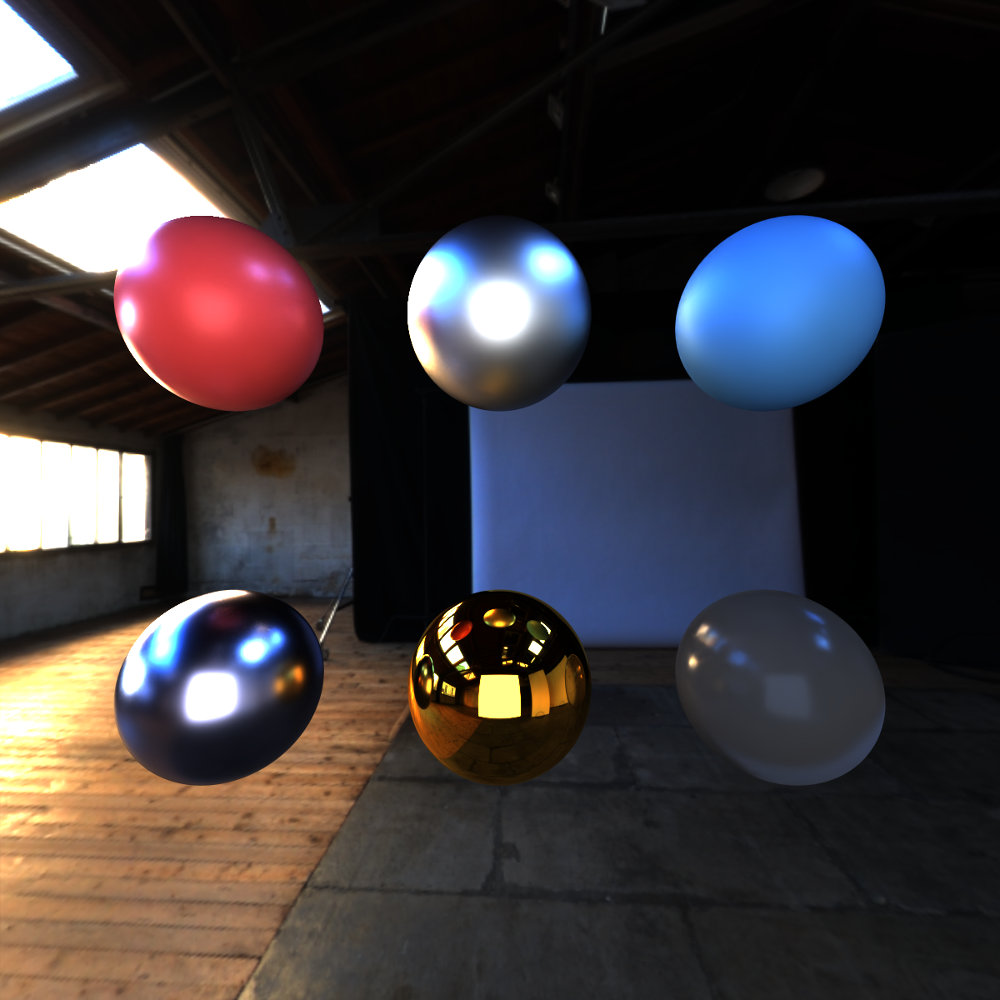


### MIS for Diffuse and PBR Shader

Multiple Importance Sampling implementation that combines three sampling strategies:
1. **Light Sampling**: Direct sampling of area lights
2. **BRDF Sampling**: Importance sampling based on material properties
3. **Environment Map Sampling**: Sampling bright regions of HDR environment maps

The implementation uses power heuristics to optimally weight contributions from different sampling strategies, significantly reducing variance and improving convergence speed. Both `shadeDiffuseMIS()` and the `shadePBR()` utilize MIS for direct lighting calculations.

<table>
<tr>
<td align="center">

<br>
<em>shadePBR With MIS</em>
</td>
<td align="center">
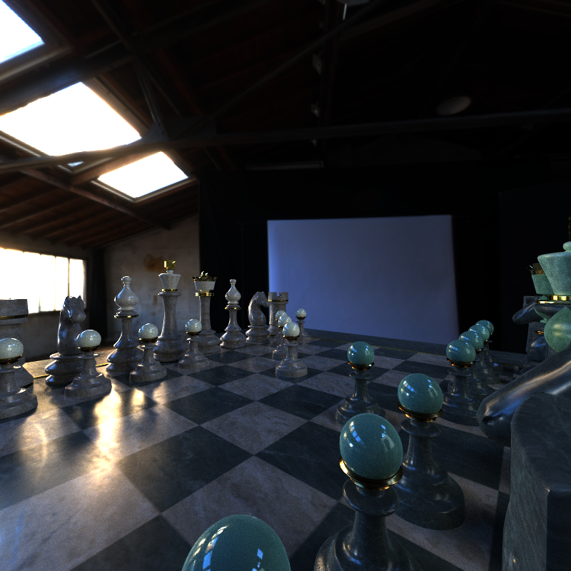
<br>
<em>shadePBR Without MIS</em>
</td>
</tr>
</table>

### Subsurface Scattering for PBR Shader

Implemented diffusion-based subsurface scattering for realistic rendering of translucent materials like jade, milk, wax, and skin. Features include:
- Configurable scattering radius and color per RGB channel
- Anisotropy control for directional scattering
- Distance-based attenuation using diffusion profiles
- Integration with PBR materials for combined surface and volume effects

The implementation simulates light penetrating the surface, scattering within the material, and exiting at different points, creating soft, translucent appearance.

<table>
<tr>
<td align="center">
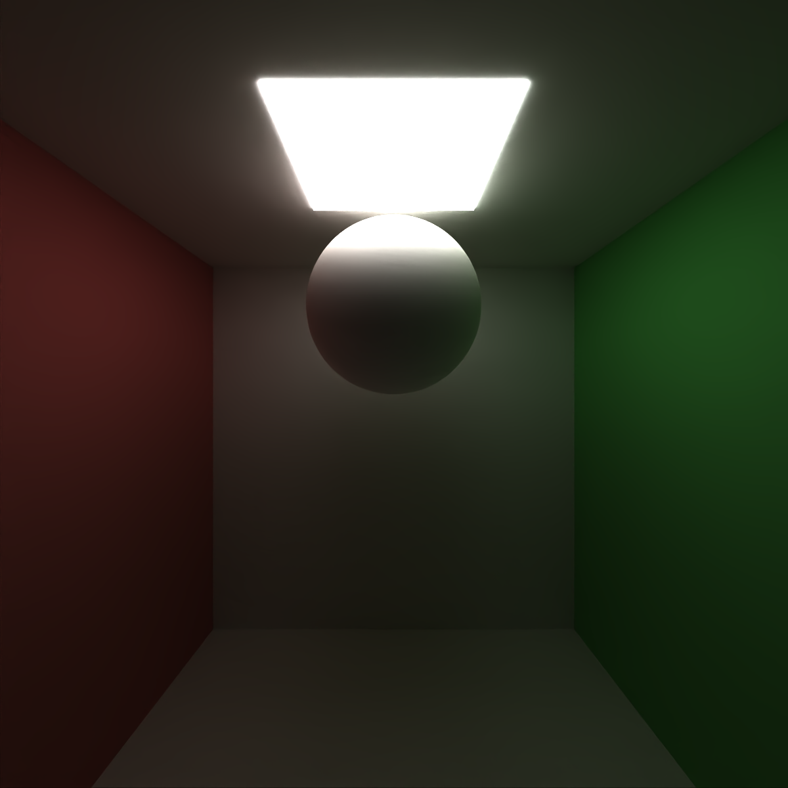
<br>
<em>Subsurface Scattering Off</em>
</td>
<td align="center">
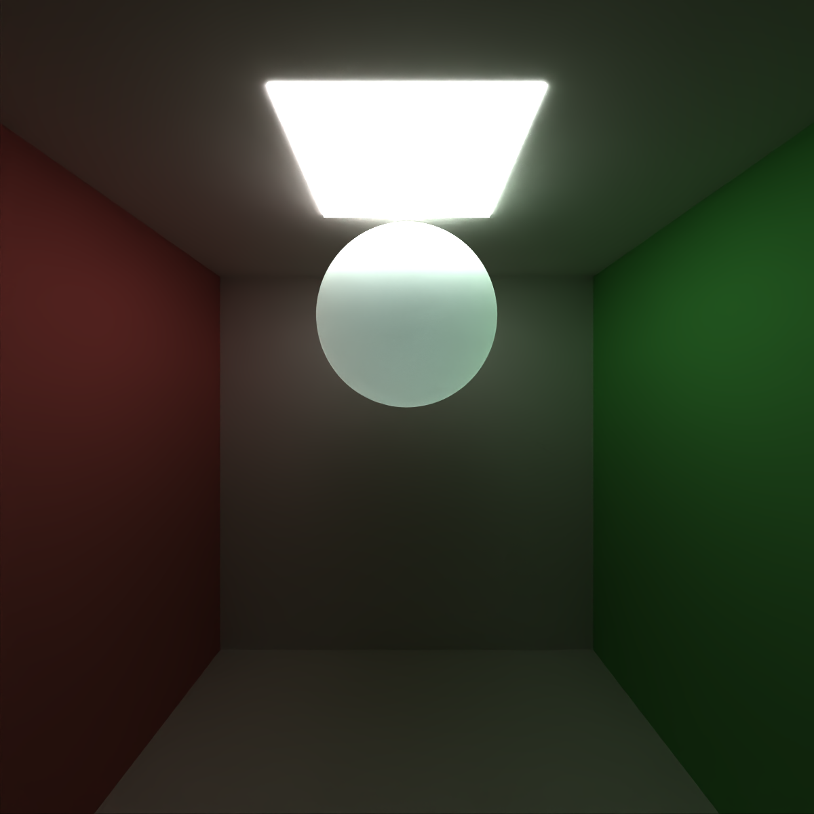
<br>
<em>Subsurface Scattering On</em>
</td>
</tr>
</table>

### Russian Roulette ray termination

Probabilistic path termination that maintains unbiased results while improving performance. Implementation details:
- Begins after configurable bounce depth (`RR_START_BOUNCE = 3`)
- Survival probability based on path throughput (luminance)
- Minimum and maximum survival probability bounds to prevent bias
- Energy compensation by dividing surviving paths by survival probability

This significantly reduces computation for dim rays that contribute little to the final image.

<table>
<tr>
<td align="center">
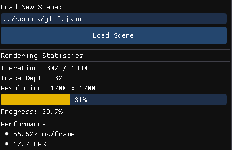
<br>
<em>Trace Depth 32 With Russian Roulette (56ms frametime)</em>
</td>
<td align="center">
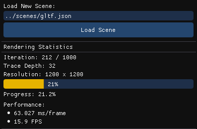
<br>
<em>Trace Depth 32 Without Russian Roulette (63ms frametime)</em>
</td>
</tr>
</table>


### Environment Maps

Full HDR environment map support for image-based lighting:
- HDR image loading with proper tone mapping
- Spherical mapping from direction vectors to texture coordinates
- Configurable intensity control
- Importance sampling with precomputed CDFs for efficient sampling
- Integration with MIS for balanced direct and indirect lighting

<table>
<tr>
<td align="center">
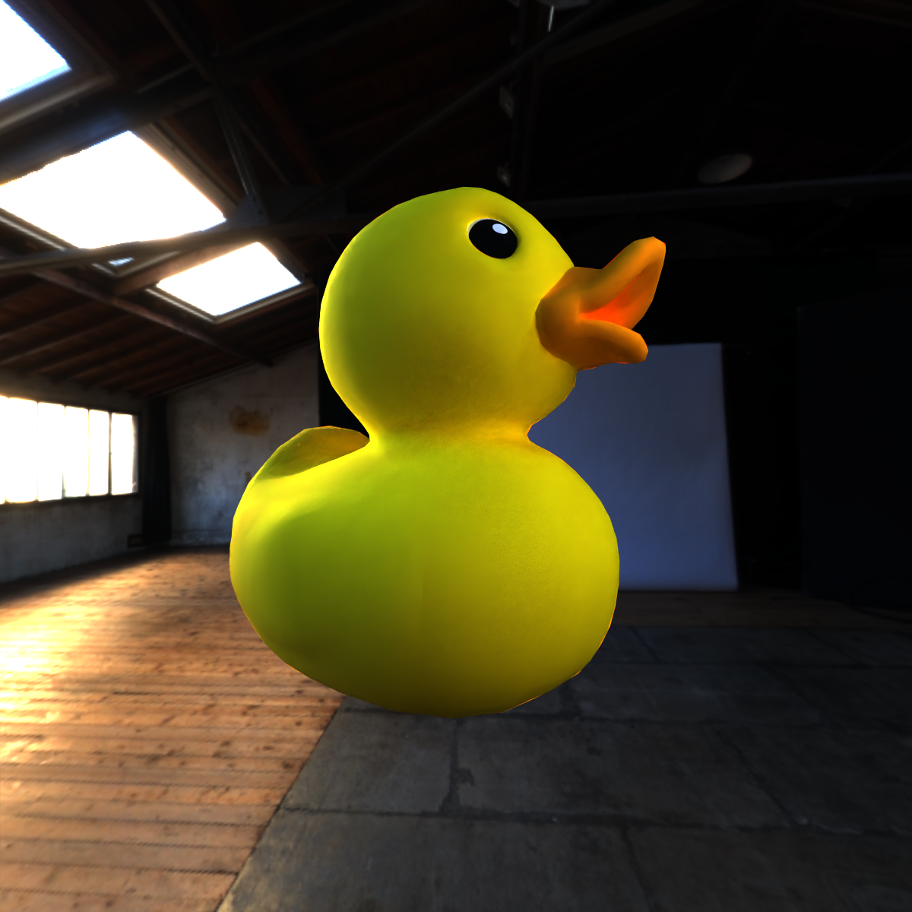
<br>
<em>Interior environment with sunlight on the left</em>
</td>
<td align="center">
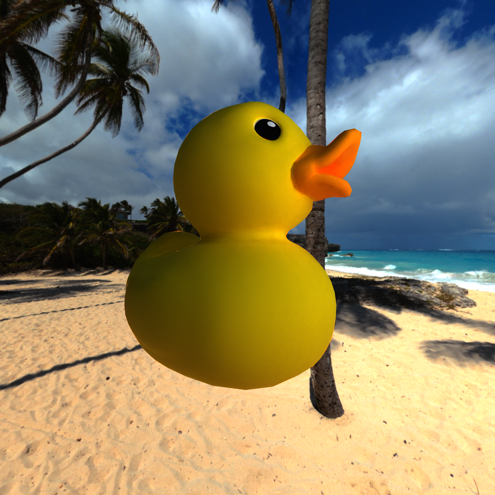
<br>
<em>Exterior environment with sunlight on the right</em>
</td>
</tr>
</table>


### GLTF Models with tinyGLTF

Comprehensive GLTF 2.0 model loading using the TinyGLTF library:
- Support for both `.gltf` (JSON) and `.glb` (binary) formats
- Triangle mesh extraction with automatic primitive assembly
- Material loading including PBR metallic-roughness workflow
- Texture loading for base color, normal, metallic-roughness maps
- Proper UV coordinate mapping
- Transformation matrix support for model positioning

#### Stanford Dragon GLTF Model, 134995 Triangles


### BVH Data Structure

Bounding Volume Hierarchy implementation for efficient ray-triangle intersection:
- SAH (Surface Area Heuristic) based construction for optimal tree quality
- CPU-side tree building with GPU-friendly memory layout
- Iterative GPU traversal using stack-based approach
- Configurable maximum tree depth (`BVH_MAX_TREE_DEPTH`)
- Dramatic performance improvement: 100x+ speedup for million+ triangle scenes

<table>
<tr>
<td align="center">
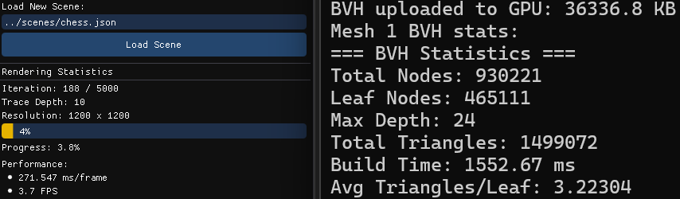
<br>
<em>1.5M Triangles Model with BVH (271ms frametime)</em>
</td>
<td align="center">

<br>
<em>1.5M Triangles Model without BVH (33494ms frametime)</em>
</td>
</tr>
</table>


### Nvidia OptiX Denoiser

Integration with OptiX 9.0 AI denoiser for real-time noise reduction:
- Beauty buffer denoising with optional guide layers
- Normal buffer guide for edge preservation
- Albedo buffer guide for texture detail preservation
- Configurable blend factor for artistic control
- Real-time parameter adjustment through ImGui
- Automatic denoising at configurable intervals

The denoiser dramatically reduces required sample count, enabling preview-quality images in seconds rather than minutes.

<table>
<tr>
<td align="center">
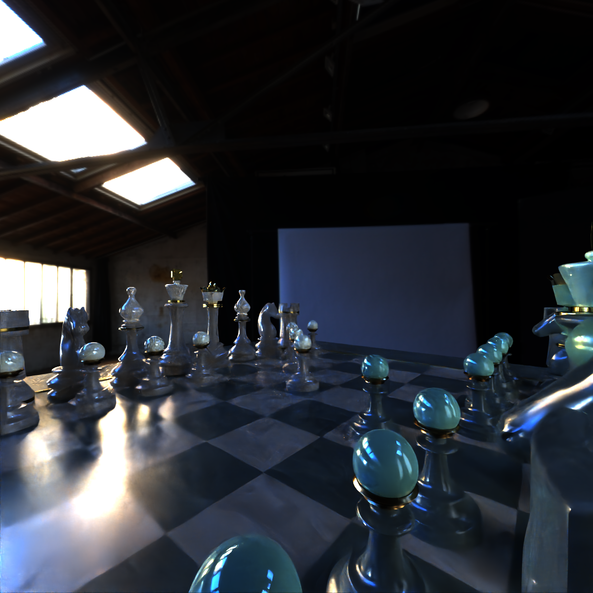
<br>
<em>50 Iterations with Denoiser</em>
</td>
<td align="center">
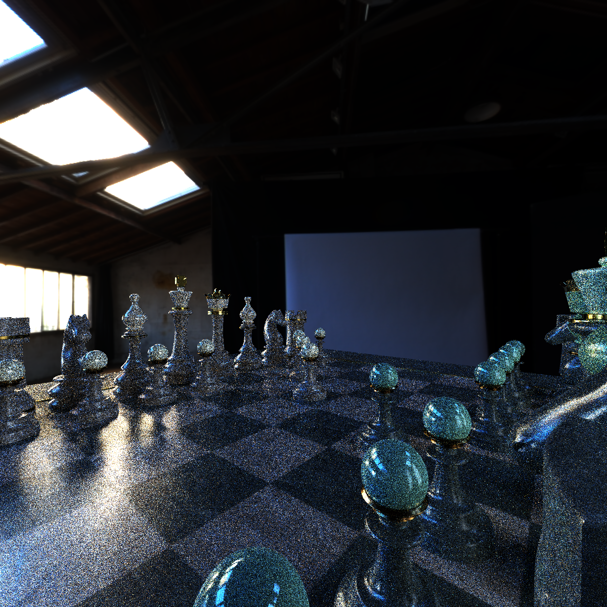
<br>
<em>50 Iterations without Denoiser</em>
</td>
</tr>
</table>

### ImGUI and controls improvements

Enhanced user interface with comprehensive debugging and control features:
- **Real-time Statistics**: FPS, rays/second, iteration count, active ray monitoring
- **Camera Controls**: Interactive orbit, pan, zoom with configurable speed
- **Scene Management**: Hot-reload scene files without restarting
- **Denoiser Panel**: Live denoising parameter control
- **Performance Monitoring**: Per-kernel timing display
- **Image Export**: One-click PNG save functionality

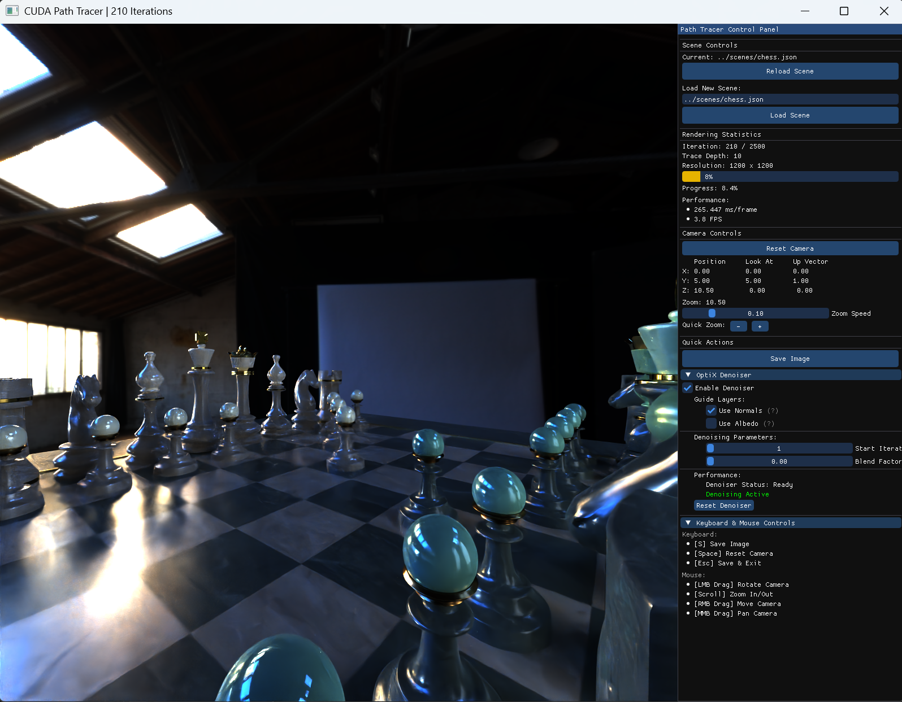


## Third-party Libraries Used

### [tinyGLTF](https://github.com/syoyo/tinygltf)

**Purpose**: Loading GLTF 2.0 3D models and associated assets  
**License**: MIT License  
**Integration**: Header-only library included in `external/include/tiny_gltf.h`  
**Usage**: Parses GLTF/GLB files to extract meshes, materials, textures, and transformations. Provides comprehensive support for the PBR metallic-roughness workflow standard in GLTF 2.0.

### [Nvidia OptiX](https://developer.nvidia.com/rtx/ray-tracing/optix)

**Purpose**: AI-accelerated denoising for rendered images  
**License**: NVIDIA Software License Agreement  
**Integration**: SDK headers and libraries linked via CMake  
**Requirements**: NVIDIA GPU with RT cores (RTX 20-series or newer) and appropriate drivers  
**Usage**: The OptiX AI denoiser is used to dramatically reduce noise in path traced images, enabling preview-quality results with minimal samples. Integrated through `optixDenoiser.cpp/h`.

## Performance Analysis

### Stream Compaction

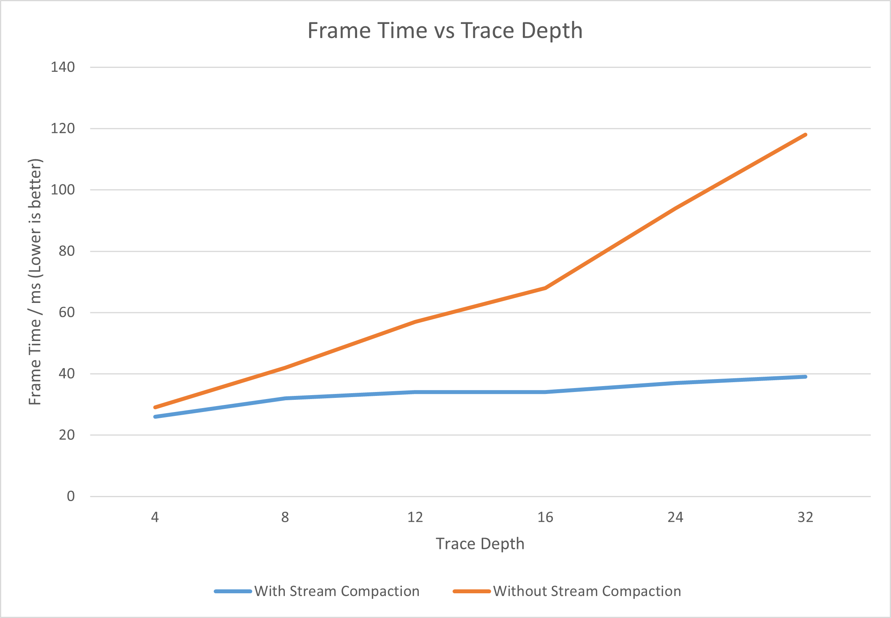

### Material Sort

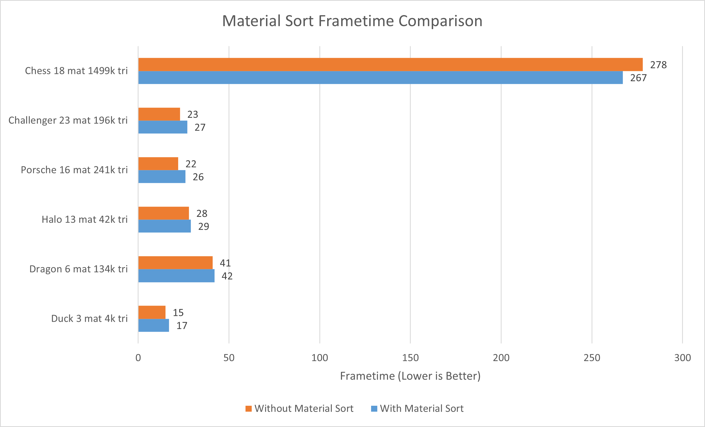

### Russian Roulette

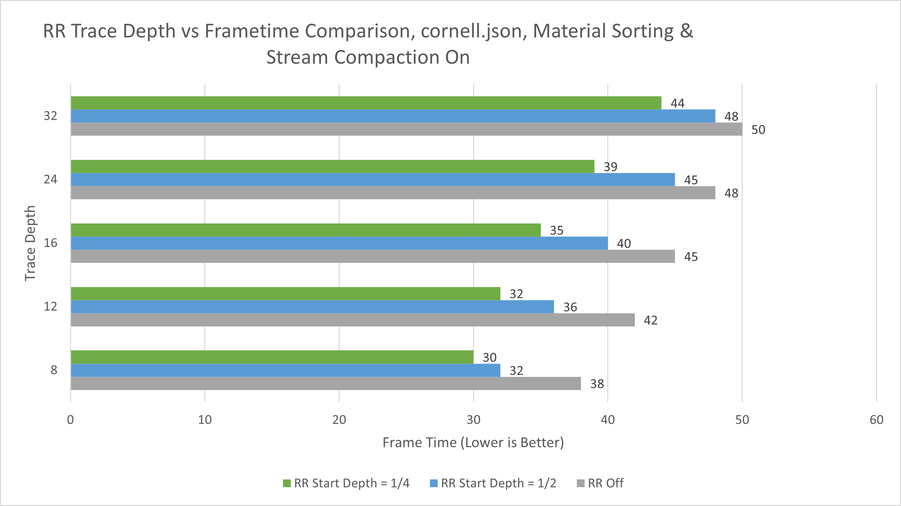

### BVH


## WIP Renders

### Subsurface Scattering


### OptiX Denoiser
See how OptiX Denoiser gives a high quality result with only 382 iterations.


### High Poly Chessboard


A 1.49 million triangles gltf model. With BVH this renders with around 80ms frametime.


Previosuly without BVH, it renders with 18000ms frametime. This render has only 1771 iterations but took 9 hours.


### Stanford Dragon


### GLTF Mesh Model with textures


### GLTF Mesh Model without textures


### PBR Materials


### Cornell Box with MIS and Environment Map


### Environment Map


### Cornell Box of Diffuse, Specular, and Refractive objects


### Specular objects


## Bloopers

### The Evil Dragon
A bug with subsurface scattering and meshes


### MIS Fireflies
